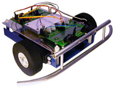
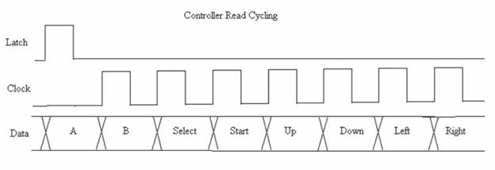
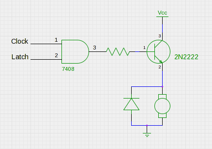
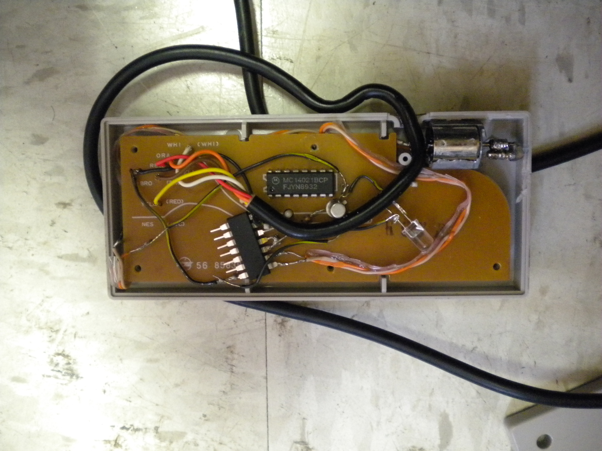

Recently, I participated in Oregon State University's [Engineering
Expo](http://engr.oregonstate.edu/expo2010/index.php). Every year,
freshmen are encouraged to enter innovative designs based on the
[TekBot learning
platform](http://eecs.oregonstate.edu/education/tekbots/index.php)
used in the ECE program.

A friend and I decided that we would try to implement a macro system
for the robot: by using an NES controller, we could have the robot
record button combinations and sequences, then play them back later.

Boy did we learn a lesson about procrastination. We started working 24
hours before the project was due, and only ended up getting it
finished at 2 in the morning. We ended up having to scale back our
plans. But not too much. What we built still is awesome.

We decided to scale back and just put a rumble pack in the controller.

For those of you that don't know, the NES controller is implemented
pretty simply in hardware:

The NES controller grabs the state of all 8 buttons: Up, Down, Left,
Right, Start, Select, A, and B, when the Latch line is pulled high on
the controller. Then, whenever it sees a low-to-high transition on the
Clock line, it sets the corresponding's button's value on the Data
Line.
 In order to make the controller rumble, we need two things:
a physical vibration device, and a way to control when the controller
rumbles.

The physical vibration device isn't too hard. We modeled our's after
the [vibrating alert](http://en.wikipedia.org/wiki/Vibrating_alert) in
a cellphone. We soldered a screw to the output shaft of a small DC
motor I found in my junk drawer.

Controlling when the motor ought to turn on was a harder challenge. If
you look carefully at the above diagram of the NES timing sequence,
you will notice that Latch and Clock, the two lines controlled by the
robot, are never high at the same time. This is because, when the
latch line is high, the NES controller disregards the Clock line. We
can take advantage of this fact to transmit a single bit of
information to the NES controller: Latch AND Clock. When both lines
are high, the motor ought to spin.

This has the obvious disadvantage that we cannot read the values of
the controller when the pack is rumbling. On the plus side however,
you have a vibrating controller!  Here's a picture of the circuitry
crammed into an NES controller:

The code for the robot was written in C for an AtTiny26. You can find
an example implementation [here](nessample.c).
