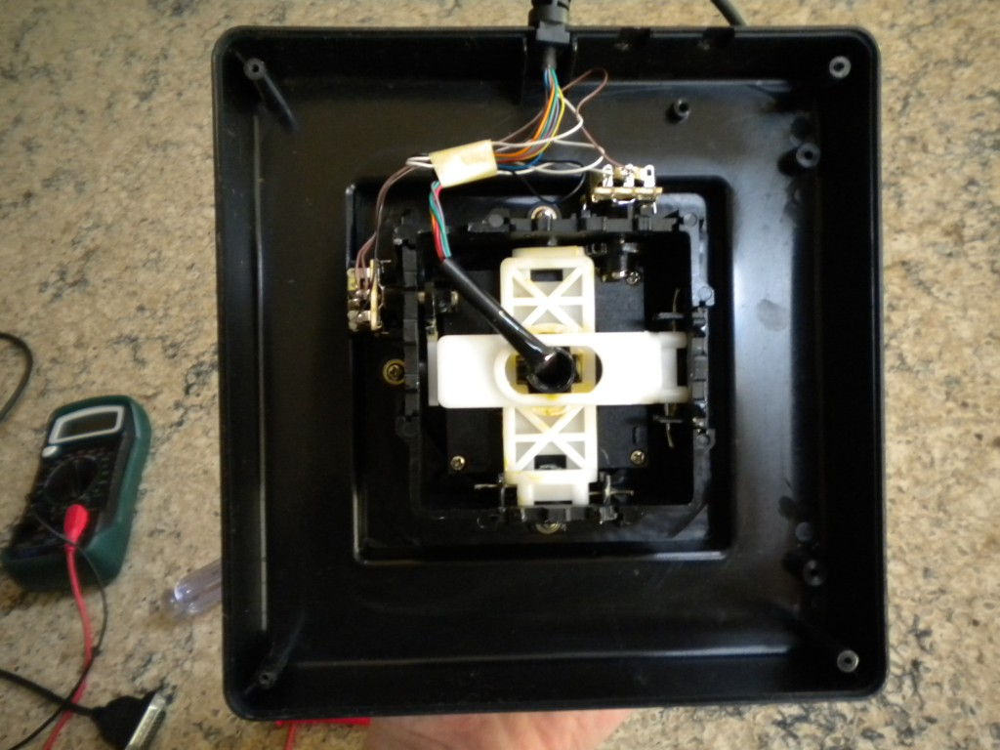
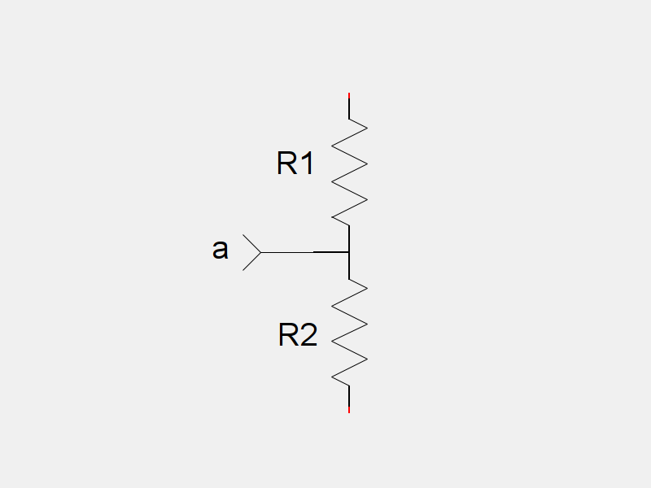
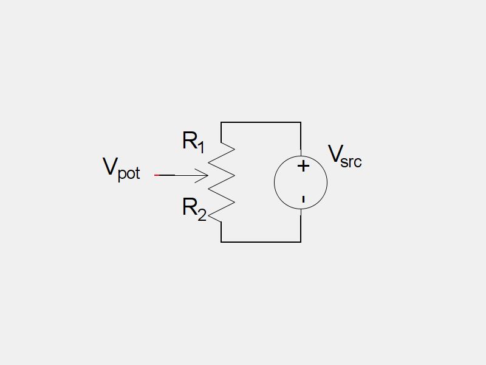
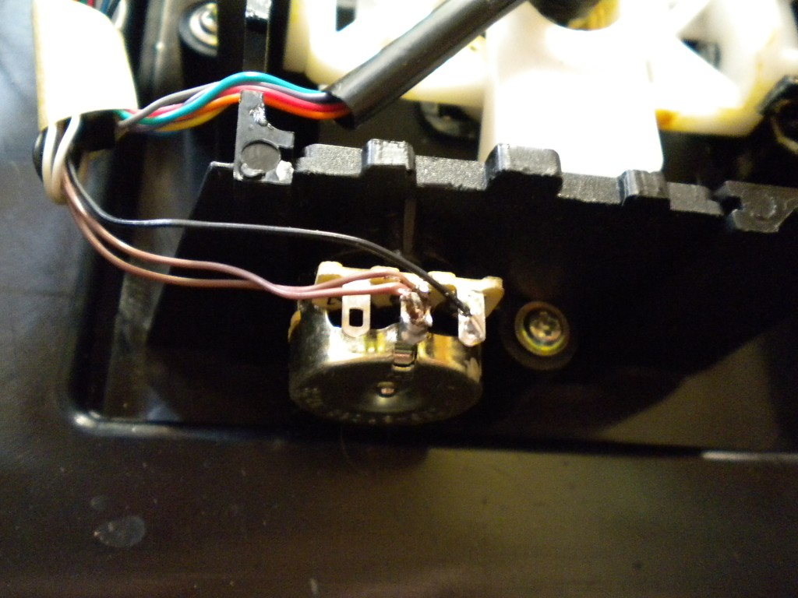
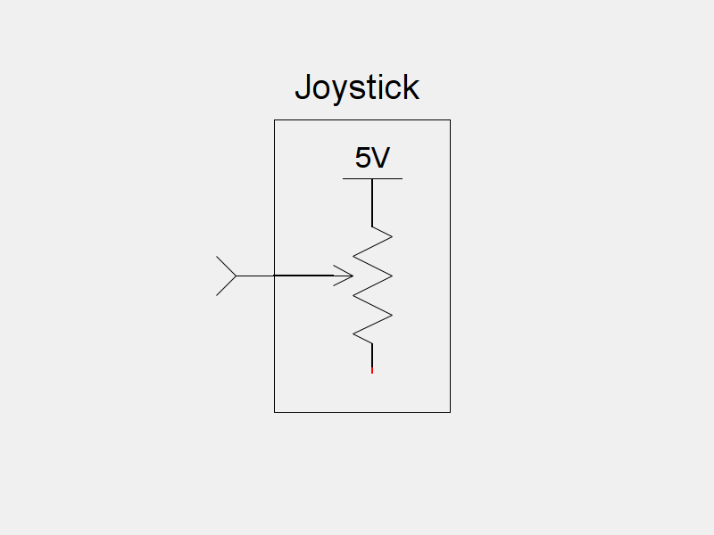
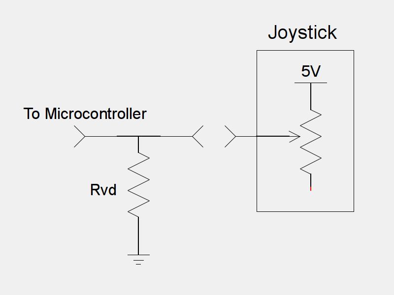
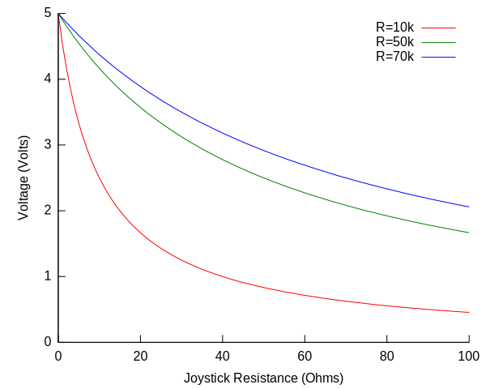
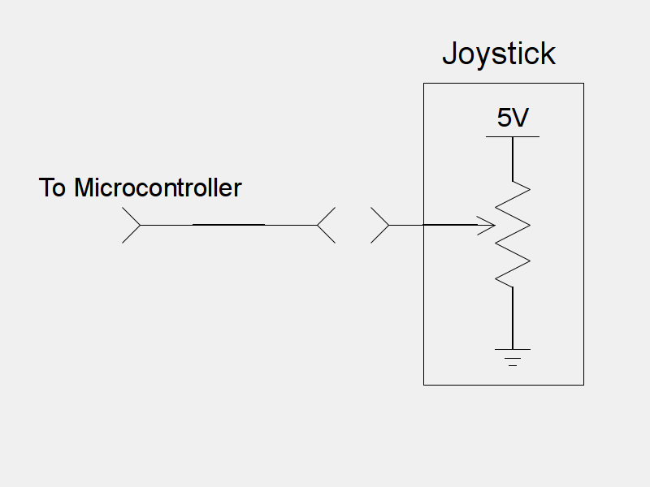

Suppose you have an old joystick that you want to use to control your
latest micro-controller project. These joysticks use a DB-15 connector
with a readily available
[pinout](http://pinouts.ru/Inputs/GameportPC_pinout.shtml). A Game
Port style joystick consists of digital buttons, and analog axes. In
this post, I will go over how to optimally interface the axes of these
types of joysticks with your microcontroller.  

Inside of the joystick, mounted at right angles are
potentiometers, one for each axis:

A potentiometer is a very basic electrical
sensor. The voltage output of an angular potentiometer is directly
proportional to the angle of its shaft relative to its case. The
symbol for a potentiometer looks like this:

A potentiometer functions like two resistor connected in series (back to back).

As the angle of the potentiometer changes relative to its case, the
resistance of the two resistors changes according to the following
function:

\begin{aligned}
R_1 =R_{max}-k\theta \quad &amp; \quad R_2 = k\theta
\end{aligned}

Where $R_1$ and $R_2$ correspond to the resistors in the above
equivalent circuit, $R_{max}$ is the maximum resistance of the
potentiometer, $\theta$ is the current angle of the potentiometer,
and k is a constant corresponding to:

\[
k=\frac{R_{max}}{\theta{}_{max}}
\]

Where $R_{max}$ is the aforementioned maximum resistance and,
$\theta_{max}$ is the maximum angle of the potentiometer. Using this
equation, you can determine the $k$ value for [this
potentiometer](http://search.digikey.com/scripts/DkSearch/dksus.dll?Detail&name=1624193-6-ND).

According  to  Digikey,  this  potentiometer  has  a  rotation  radius
$\theta_{max}$ of 270 degrees.  It also has a resistance $R_{max}$
of 100,000 ohms. This means it has a $k$ value of:

\[
k = \frac{R_{max}}{\theta_{max}} = \frac{100000}{270^\circ} \approx 370.4
\]

Since the values of these resistors change depending on the current
angle of the potentiometer, it would make sense to rewrite them as
functions:

\begin{aligned}
r_1(\theta) =R_{max}-k\theta \quad &amp; \quad r_2(\theta) = k\theta
\end{aligned}

[Ohm's Law](http://en.wikipedia.org/wiki/Ohm%27s_law) says that
voltage is equal to current times resistance. If you were to connect a
constant voltage source across the outside terminals of our
potentiometer:

The current, $I_{pot}$ through $R_1$ and $R_2$  can be found:

\begin{aligned}
V &amp; = &amp; IR \\
I &amp; = &amp; \frac{V}{R} \\
I_{pot} &amp; = &amp; \frac{V_{src}}{R_{pot}}
\end{aligned}

Since the two resistor halves of the potentiometer are in series,
their resistance adds:

\[ R_{pot} = r_1(\theta)+r_2(\theta) \]

This gives us

\[ I_{pot} = \frac{V_{src}}{r_1(\theta)+r_2(\theta)} \]

If you were to insert a miniature current sensor right into the middle
of the potentiometer, this is the current that it would
measure. Unfortunately, in the real world, miniature current sensors
are hard to come by. We would like some way determine the angle of the
potentiometer using the voltage at its middle point.

If we say that the negative terminal of the voltage source has a
voltage of zero volts, then the voltage at the middle of the
potentiometer is equal to the voltage across $R_2$:

\[ V_{pot} = V_2 \]

How do we find the voltage across $V_2$? We use Ohm's Law again:

\begin{aligned}
V &amp; = &amp; IR \\
V_2 &amp; = &amp; I_{pot} \cdot R_2 \\
V_2 &amp; = &amp; \frac{V_{src}}{r_1(\theta)+r_2(\theta)} \cdot r_2(\theta) \\
V_2 &amp; = &amp; V_{src} \cdot \frac{k\theta}{R_{max}-k\theta + k\theta} \\
V_2 &amp; = &amp; V_{src} \cdot k \cdot \frac{\theta}{R_{max}} \\
V_2 &amp; = &amp; V_{src} \cdot \frac{R_{max}}{\theta_{max}} \cdot \frac{\theta}{R_{max}} \\
V_2 &amp; = &amp; V_{src} \cdot \frac{\theta}{\theta_{max}} \\
V_{pot} &amp; = &amp; V_{src} \cdot \frac{\theta}{\theta_{max}}
\end{aligned}

In other words, the voltage outputted by the potentiometer is directly
proportional to the angle of the potentiometer. This is useful. It
means that if you can measure the voltage of a potentiometer, you can
easily determine its angle, given its maximum rotation.

For example, suppose that the $270^\circ$ potentiometer from before
is connected to your microcontroller. Assume the source voltage for
the potentiometer is 5 volts. If you read 3.7 volts on the
potentiometer, you can easily calculate its angle:

\begin{aligned}
V_{pot} &amp; = &amp; V_{src} \cdot \frac{\theta}{\theta_{max}} \\
\theta &amp; = &amp; \frac{V_{pot}}{V_{src}} \cdot \theta_{max} \\
\theta &amp; = &amp; \frac{3.7}{5} \cdot 270^\circ \\
\theta &amp; = &amp; 199.8^\circ
\end{aligned}

The potentiometer must be at an angle of approximately 200 degrees.

It makes sense that joysticks would use potentiometers to determine
its position. However, the potentiometers are not hooked up in the
standard way:

In the above picture, you will notice that only two of the terminals
of the potentiometer are hooked up. In this arrangement, the
potentiometer is functioning as a _variable resistor:_ Its resistance
is directly proportional to the angle of the shaft. The circuit for
these potentiometers looks like this:

You can see that the bottom terminal of the potentiometer (the little
red bit) is not connected to anything. There is a historical reason
for this. When IBM first developed the Game Port for the original
IBM-PC, they wanted to use cheaper timing based solutions to measure
the deflection of the joystick axes. The time it took for a timer to
trigger would be proportional to the resistance of the potentiometer,
which would in turn be proportional to the angle of the
potentiometer. Nowadays, microcontrollers have built in
analog-to-digital converters, obviating the need for any kind of
timer. Unfortunately for us, the decades old Game Port design won't
work directly with a modern microcontroller: It outputs a variable
resistance, and we want a variable voltage.

There are two solutions to this problem, with different trade offs for each.

The easiest solution is to connect a resistor to the joystick
connector for this axis:

This circuit looks a lot like the circuit we had for the basic
potentiometer, exception that the resistance of the $R_2$ is
constant. To find the voltage that would be seen by a microcontroller,
we again need to calculate the current through the joystick resistor,
and the other resistor:

\begin{aligned}
V &amp; = &amp; IR \\
I &amp; = &amp; \frac{V}{R} \\
I_{pot} &amp; = &amp; \frac{5}{R_{pot} + R_{vd}}
\end{aligned}

Once we have an equation for $I_{pot}$, we can easily find an
equation for $V_\mu$:

\begin{aligned}
V &amp; = &amp; IR \\
V_\mu &amp; = &amp; I{pot} \cdot R_{vd} \\
V_\mu &amp; = &amp; \frac{5 R_{vd}}{R_{pot}+R_{vd}}
\end{aligned}

Assuming that the range of the potentiometer is from 0 ohms to 100
ohms, we can see that this function is not linear. As the resistance
of the potentiometer changes, the voltage that the microcontroller
sees also changes, but they are not related linearly. Also, the
voltage depends on the value of $R_{vd}$ chosen. Listed below are
graphs of the microcontroller's voltage for several different values
of $R_{vd}$:

Assume that when the joystick has a resistance of 50k ohms when it is
at rest in the middle. It makes sense, then, that when it is fully
extended in one direction, its resistance would be 100k ohms, and when
fully extended in the other direction, its resistance would be 0
ohms. You can see by looking at this graph that for some values of
$R_{vd}$, the range of the output voltage $V_\mu$ is nowhere near
the total range from 0 volts to 5 volts. Also, you can see that the
range of $V_\mu$ for values less than 50k ohms is much larger than
the range for values greater than 50k ohms. Practically, this means
that when we deflect the joystick in one direction, we will get a
larger change in voltage that if we moved it in the other
direction. This is obviously less than ideal. However, this design
does have some pros. We do not need to modify the joystick to
implement this circuit, which means that we can still use this
joystick with a computer.

Another way to solve this problem, is to modify the joystick, so that
the potentiometers are hooked up in the standard way:

We have already seen that in this configuration, the voltage read by
the microcontroller is directly proportional to the angle of the
potentiometer. The downside to this method is that it requires
modifying the joystick. Once this modification is made, you can't plug
the joystick into a computer anymore. However, the values read out of
the joystick are much more accurate.

There are two different ways to attach a Game Port style joystick to a
microcontroller. They both have their advantages, and their
drawbacks. The external resistor solution requires a software
algorithm to normalize the output of the potentiometer, while the
potentiometer fix requires modifying the joystick's hardware. The
solution you choose is up to you.