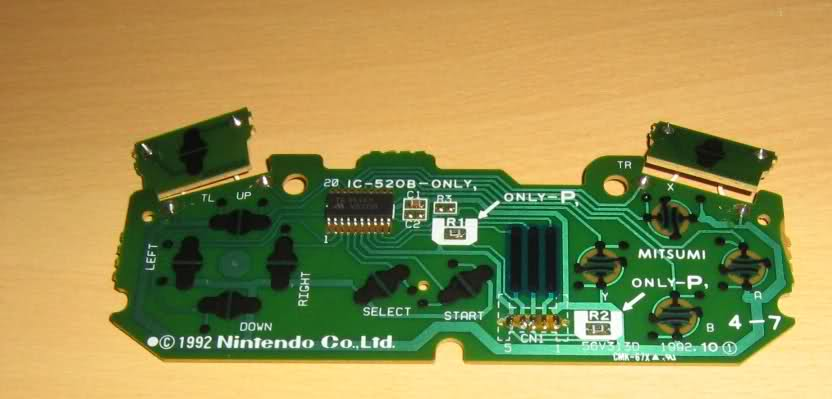
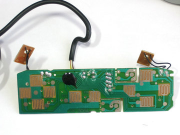

<meta name="keywords" content="SNES,tutorial"/>

One of the problems we faced when designing the schematic for the
wireless SNES controller, is whether to leave the original PCB in, or
fabricate a complete replacement. Implementing the controller on a
smaller circuit board would make it cheaper to manufacure: most PCB
prototyping companies bill by the square inch. However, using a
smaller board would result in an extremely cramped layout, and might
require physical modification of the plastic supports on the inside of
the circuit board. Instead, we decided to replace the entire PCB. As
we had already decided this project was for fun, money was no
object. Also, the larger amount of space on the bigger board makes it
easer to route the circuit. Unfortunately, there is one more downside
to the full PCB approach: the replacement PCB must fit exactly into
the space left by the older board. This led to another issue: the PCB
will only fit in a single brand of SNES Controller.

 

## Picking a Controller

Take a look at the following two pictures:

The first picture is from a real Nintendo SNES controller. It is
well-marked, and includes the manufacturer and the year it was
designed. Notice the protective coating on the rubber-dome contacts.

The second picture is from a cheap, knockoff controller. It lacks the
manufacturer's identifying information, as well as the protective
coating on the button contacts. Most importantly, the physical
dimensions of the circuit board are drastically different than the
dimensions of the official Nintendo board. If we were going to design
a replacement PCB for the SNES controller hardware, we would need to
pick a controller brand to base it off of.

In the end, we decided to stick to the original nintendo
controllers. They are about twice as expensive as third-party
controllers, however a pair of them can be found on eBay for less than
twenty dollars. Additionally, because these are the official Nintendo
controllers, we do not need to worry about the controller supplier
going out of business or changing its design: The Nintendo controller
is no longer manufactured, and therefore cannot change its design. 
