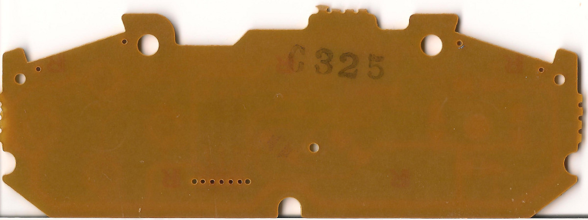
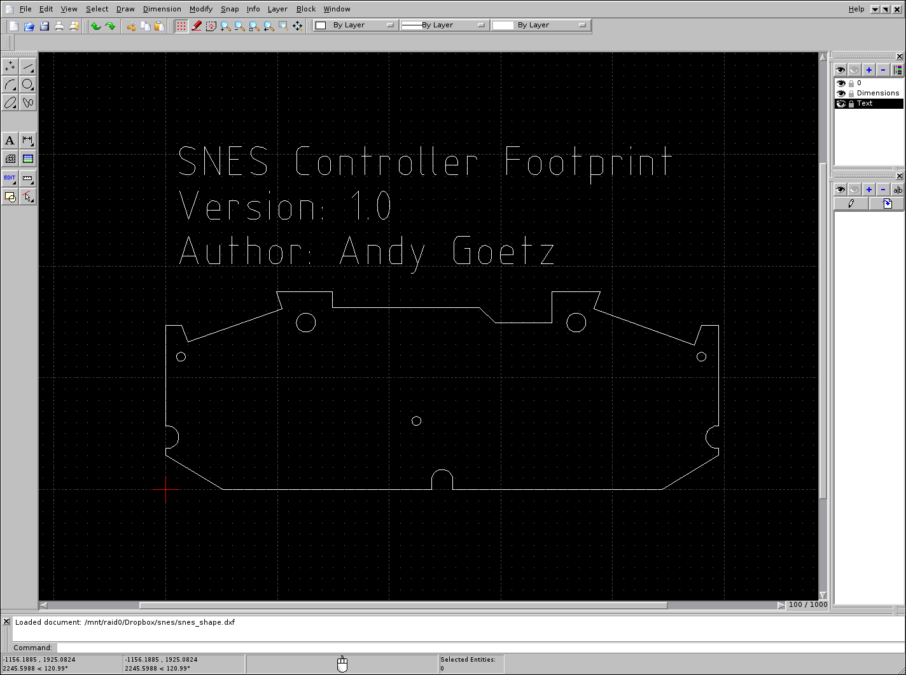
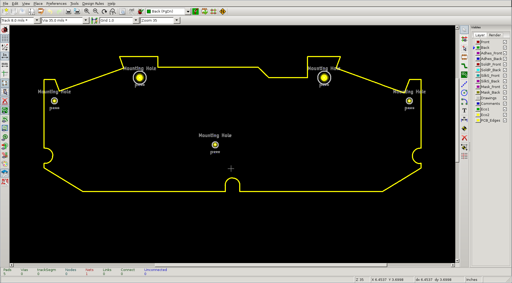

<meta name="keywords" content="SNES,tutorial,kicad,qcad"/>

The board design for the SNES wireless controller project is
proceeding nicely. I recently finished the main controller schematic,
after running into multiple difficulties about how exactly to
implement its electronics. Next up: laying out the circuit board. This
presented its own set of challenges, which eventually led to me
developing a powerful tool for simplifying the layout of complicated
circuit boards. 

 

## Capturing the PCB dimensions

Below is a scan I made of the back of the Official Nintendo SNES Controller PCB:

This picture shows the dimensions of the circuit board, without any
distracting traces or solder pads. You can clearly see that the shape
of this board is relatively complex: It has semicircular cutouts on 3
of its sides. These cutouts wrap around plastic columns on the inside of
the SNES Controller. Additionally, the top corners have angled
cutouts. These cutouts are designed to leave just enough space for the
trigger circuit boards to fit in. The dimensions of the above features
are a critical feature of this PCB. If the trigger slots are too deep,
the trigger PCB will have room to slide around, possibly impacting the
reliability of the trigger buttons. Likewise, if the semicircular
cutouts are off by too much, the PCB will not fit in the original
controller. 

I decided to capture the Controller dimensions in a 2D CAD program,
before attempting to design the PCB. This would provide me with a
detailed reference I could use when actually designing the dimensions
of the real PCB. There are several reasons to use a 2D CAD program
instead of directly implementing the board dimensions in EDA
software. First of all, the 2D CAD software has much more powerful
tools for creating accurate drawings. Secondly, it is useful to have
the footprint in a format that would make it easy to test mechanical
prototypes: The output from the 2D CAD program can be passed to a
laser cutter. This will create a test board useful for verifying the
dimensions of replacement PCB.

I decided to use the open source CAD program
QCAD. This program made it relatively easy to capture the PCB
dimensions. 

I started by using GIMP to measure the dimensions of the circuit board
from the high-resolution scan shown above. This let me get a rough
estimate of the dimensions of the PCB. I then printed out a copy of
the design, and tried to align the PCB with the CAD drawing. Any
misalignments were adjusted in QCAD, until a footprint was created
that matched the SNES Controller perfectly. 

My original plan called for drawing the PCB footprint in KiCad at this
time. It was at this point that I ran into another major problem. Take
a look at these example [kicad
screenshots.](https://www.google.com/search?num=10&hl=en&site=&tbm=isch&source=hp&biw=1918&bih=966&q=pcbnew+screenshots&oq=kicad+pcbnew)

You should immediately notice that all of these PCBs are
rectangular. The edges are all much simpler than the SNES PCB. There
is a very good reason for this: The drawing tools in KiCad stink. You
can only create lines, circles, rectangles and arcs, and these
elements must be placed essentially freehand. There is no way to
manually enter the dimensions or angle of any of these elements. In
addition, the arc tool only allows for 90 degree curves. 

I had just spent several painstaking hours importing the
SNES dimensions into QCAD. I did not want to throw away all of this
work just to start over again in KiCad. In addition, I did not want to
maintain two separate copies of the SNES footprint, one in QCAD and
one in KiCad. 

That is when it struck me. What if I wrote a converter to convert the
QCAD files into a format that KiCad could understand?

## Introducing dxf2brd

QCAD stores its drawing in a file format called
[DXF](http://en.wikipedia.org/wiki/AutoCAD_DXF). DXF stands for
_Drawing Interchange Format_. This is an old file format created by
Autodesk, and it serves as a lingua franca in the world of Mechanical
Manufacturing. Crucially, there exist several open source libraries to
parse DXF files.

Kicad stores PCB design data in a custom file format called
[BRD](http://www.kicad-pcb.org/display/KICAD/File+Formats). This file
format is simple ascii, and is fairly easy to parse. 

dxf2brd is a simple helper utility that reads DXF files, and
translates lines, circles and arcs from the DXF file to the Kicad BRD
coordinate space. In addition, it converts circles in the DXF file
into mechanical holes that Kicad can use to create the drill file.

## Conclusion

Overall, I am extremely happy with the combination of QCAD and
KiCad. Using QCAD to draw complex shapes is much easier than trying
force the design in Kicad, and it allows us to use standard rapid
prototyping tools, such as a laser-cutter, to make sure the dimensions
match perfectly. Additionally, the dxf2brd tool makes it a snap to
design complex circuit boards in a real CAD tool, before exporting the
results into EDA tools. 

<b> Source Files:<b> &nbsp;
[dxf2brd](https://github.com/apgoetz/dxf2brd)
[snes_shape.dxf](snes_shape.dxf)
[scanner.brd](scanner.brd)
