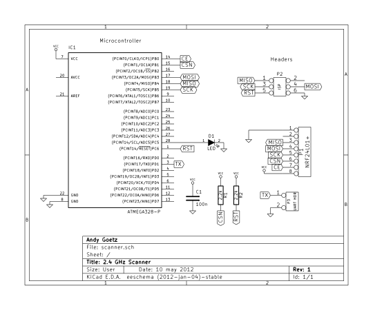

<meta name="keywords" content="nRF24L01p,SPI"/>
As part of a larger project, I recently purchased several 2.4 GHz
wireless tranceivers based around the
[nRF24L01+](http://www.nordicsemi.com/eng/Products/2.4GHz-RF/nRF24L01P)
IC. These handy chips allow the user to send short messages to other
individually addressed nodes, and even include support for automatic
retransmission of garbled messages.  None of these advanced features
will be used in this article: we won't even be transmitting messages
with the transeiver. The purpose of this article is to describe the
physical interface of the nRF24L01+ transmitter, as well as how to
control it, with the end goal of building a rudimentary RF detection
device. This device scans through all of the 2.4 GHz channels usable
by the nRF24L01+, and flashes an LED when it detects received power on
that channel. In addtion, the number of the channel that the signal
was detected on is printed out over a UART.

# Getting Your Hands on the Hardware
In order to prototype using the nRF24L01+ tranceiver, it is necessary
to either purchase or build a reference design using the chip.
Fortunately for us, Nordic Semiconductor provides detailed reference
designs on their product, and several companies have developed
breakout boards based on these designs. Two notable designs are those
of [Sparkfun](http://www.sparkfun.com/products/691) and
[MDFLY](http://www.mdfly.com/index.php?main_page=product_info&cPath=8&products_id=81&zenid=98sjt2i4lvj6uhviqb587uuoo6).
The MDFLY design is almost an exact copy of the reference design, and
provides one of the lowest cost solutions on the market, while the Sparkfun
implementation includes a 3.3V voltage regulator. This regulator makes
it extremely easy to interface with traditional 5V microcontrollers
using a single powersupply.

The nRF24L01+ tranceiver has a very simple interface. It uses
[SPI](http://en.wikipedia.org/wiki/Serial_Peripheral_Interface_Bus) to
control the hardware, with one additional pin used to determine
whether the device is in active or standby mode. Additionally, there
is interrupt pin on the tranceiver that allows it to alert the
attached micro controller when certain conditions are met, such as
when the transmit buffer is empty, or if the tranceiver has received a
packet. This pin will not be used in this article's application. Even
though the nRF24L01+ needs a 3.3V power supply, the input pins are
designed to handle signaling at up to 5 volts, making them easy to
interface with existing micro controllers.

The microcontroller I am going to be using in this article is a
ATMega328P, the same microcontroller used in the arduino. This
microcontroller can be operated at 5 or 3.3 volts, making it simple to
integrate with whatever design you use for the tranceiver. The entire
hardware circuit can be seen below: 

This circuit is very simple: The LED **D1** is turned on and off as power
is detected on the various channels, and the serial data is printed
out using the hardware UART on the TX pin. In this circuit, the
sparkfun breakout board pinout is used, but it is simple to substitute
a different design.

# Talking to the nRF24L01+ 

The  nRF24L01+   has  a   very  simple  SPI   interface  it   uses  to
communicate.  The slave  select pin  is referred  to as  *CSN* in  the
Nordic Semiconductor information. The tranceiver  will not use the bus
unless this  line is pulled low.  It is externally pulled  high by the
resistor  *R1* in  order  to prevent  the  tranceiver from  enabling
itself  when the  microcontroller is  not  driving this  line high  or
low. This occurs when the microcontroller is being programmed.

The command set for the nRF24L01+ is composed of two parts:
straightforward SPI commands, and an internal configuration register
set. There are several SPI commands for common operations, such as
reading the status of the device, reading a packet from the receive
buffer, or specifying a packet transmit. Additionally, there is a set
of registers that configure things such as the channel the device is
operating in, the amount of power to use to transmit, the address of
the tranceiver, etc. These registers are accessed using special read
and write SPI commands. It should be noted, that these registers are
not all the same size: most registers are 1 byte in size, however some
are 5 bytes.

#2.4GHz Scanning 

The 2.4Gz section of the radio-frequency spectrum does not require a
special license to broadcast in. As a result, many consumer devices
broadcast in this region. For example, baby monitors, cordless phones,
and Wi-Fi all operate in the 2.4Ghz spectrum.

The nRF24L01+ also operates in the 2.4GHz range. We can take advantage
of the diagnostic features of the nRF24L01+ to detect devices
transmitting on this frequency.
